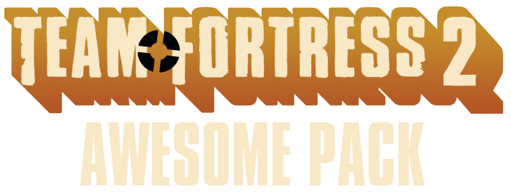

	

The Awesome Pack is a modifcation for [Team Fortress 2](https://store.steampowered.com/app/440/Team_Fortress_2/) that offers improvements and total remakes of various textures and models. All of the sources for the remade assets from this project is public for anyone to view and use.

# Disclaimer & Usage

Team Fortress 2 Awesome Pack is not affiliated to [Valve Corporation](https://www.valvesoftware.com/en/) in anyway.

This repository only contains sources for the remade assets. Anyone can freely edit any of the sources and use it for their own mods as a base. Credit is required if you do use anything from this project. You are not allowed to host or reupload The Awesome Pack files onto other sites, projects, or the Steam Workshop without explicit permission.

If you wish to contact me. You can email me at contactjustyn@gmail.com

# Contributors

[Seal](https://github.com/DR-Seal) - For creating the high quality rocket mesh

[Rob5300](https://github.com/rob5300) - For creating the [VTEX batch compile script](https://github.com/rob5300/BatchVTF/blob/main/batchvtex.py)